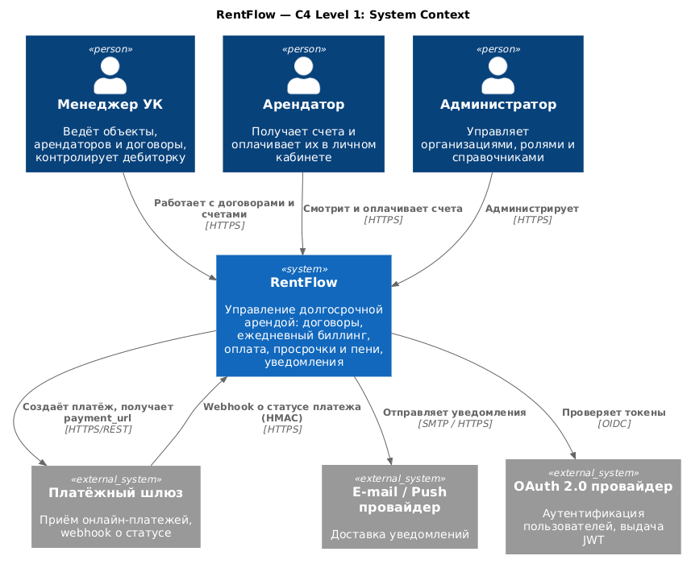
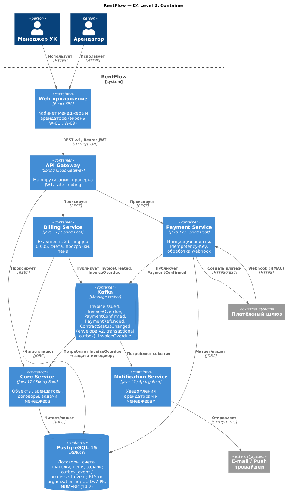

# Архитектура
Система строится как набор сервисов за единым API Gateway: Core (объекты, арендаторы, договоры),
Billing (счета, пени, cron), Payment (интеграция со шлюзом, webhook), Notification, Task.
Обмен событиями — Kafka. Хранилище — PostgreSQL 15. Стек: Java 17 / Spring Boot.

## C4-модель архитектуры

Уровень System Context — `diagrams/c4_context.puml`:

Уровень Container — `diagrams/c4_container.puml`:

## Архитектурные решения (ADR)

* [ADR-0001: UUID v7 как первичные ключи](adr/0001-uuid-v7.md)
* [ADR-0002: TEXT + CHECK вместо ENUM](adr/0002-text-check-enum.md)
* [ADR-0003: Transactional outbox для Kafka](adr/0003-transactional-outbox-kafka.md)
* [ADR-0004: Агрегаты счёта через триггер](adr/0004-penalty-single-source.md)
* [ADR-0005: Две оси статуса счёта](adr/0005-invoice-two-status-axes.md)
* [ADR-0006: Row Level Security по organization_id](adr/0006-row-level-security-organization-id.md)
* [ADR-0007: Часовой пояс организации](adr/0007-organization-timezone.md)
* [ADR-0008: EXCLUDE на периоды договоров](adr/0008-exclude.md)
* [ADR-0009. Хранение пароля в user_account.password_hash (argon2id)](adr/0009-password-hash-argon2id.md)
* [ADR-0010. Переплата не отклоняется, а зачитывается в следующий счёт](adr/0010-overpayment-credit.md)
