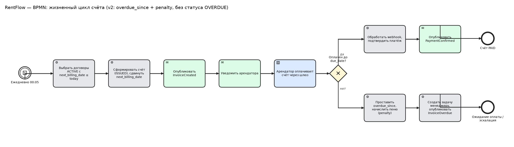

# Ключевые бизнес-процессы
| ID | Сценарий | Актор | Результат |
|---|---|---|---|
| UC-01 | Заключение договора | Менеджер | Договор ACTIVE |
| UC-02 | Автоматическое начисление платежа | Система (cron) | Счёт ISSUED, уведомление |
| UC-03 | Оплата счёта через шлюз | Арендатор | Платёж CONFIRMED, счёт PAID |
| UC-04 | Обработка просрочки и пени | Система | Счёт помечен `overdue_since`, пеня, задача менеджеру |
| UC-05 | Корректировка счёта | Менеджер | Новая сумма счёта |
| UC-06 | Расторжение договора | Менеджер | Договор TERMINATED |

Sequence-диаграммы UC-02/03/04 — в `diagrams/seq_*.puml`.

## BPMN-модель сквозного процесса «Выставление счёта и оплата»

Модель в формате BPMN 2.0 XML — `diagrams/bpmn_invoice_lifecycle.bpmn` (открывается в Camunda Modeler или bpmn.io).

