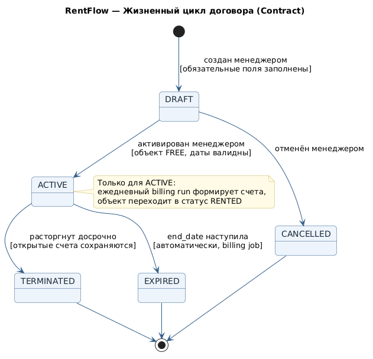
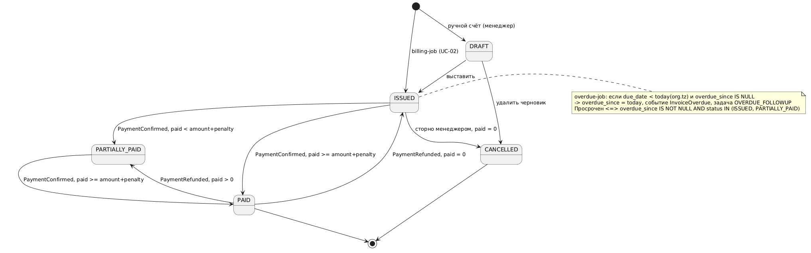
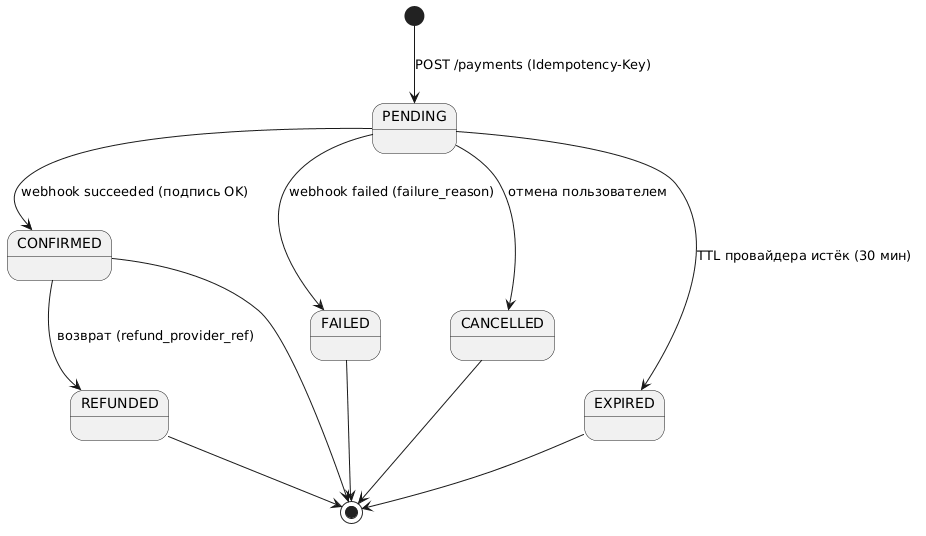
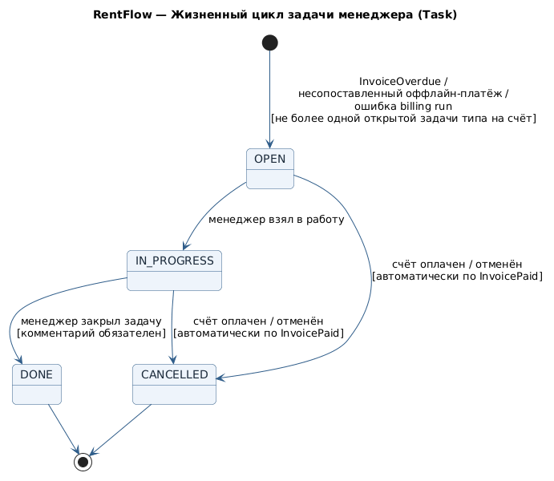

# Модели состояний
Диаграммы — `diagrams/state_*.puml`.

- **Contract:** DRAFT → ACTIVE → SUSPENDED / EXPIRED / TERMINATED
- **Invoice:** DRAFT → ISSUED → PARTIALLY_PAID → PAID; ISSUED → CANCELLED (paid = 0); PAID → PARTIALLY_PAID / ISSUED при возврате. Просрочка — отдельная ось `overdue_since` (ADR-0005), состояния OVERDUE нет: счёт просрочен ⇔ `overdue_since IS NOT NULL AND status IN (ISSUED, PARTIALLY_PAID)`
- **Payment:** PENDING → CONFIRMED / FAILED / CANCELLED / EXPIRED; CONFIRMED → REFUNDED
- **Task:** NEW → IN_PROGRESS → DONE; → CANCELLED

## Диаграммы состояний

Исходники — `diagrams/state_*.puml` (единый стиль подключается через `!include _style.puml`), готовые PNG — `img/`.

### Договор (Contract)

### Счёт (Invoice)

### Платёж (Payment)

### Задача менеджера (Task)

## Дополнения v2.0

| Состояние | Биллинг новых счетов | Пени по выставленным | Платежи | Объект занят (EXCLUDE) |
|---|---|---|---|---|
| DRAFT | нет | — | нет | нет |
| ACTIVE | да | да | да | да |
| SUSPENDED | **нет** | **да** | да | да |
| EXPIRED | нет | да | да | нет |
| TERMINATED | нет | да (до полной оплаты) | да | нет |

DRAFT->ACTIVE — активация (проверка EXCLUDE, 409 при пересечении); ACTIVE<->SUSPENDED — менеджер; ACTIVE->EXPIRED — job в 00:05 org.tz при end_date < today; ACTIVE/SUSPENDED->TERMINATED — расторжение, открытые счета остаются к оплате, `next_billing_date = NULL`.
Счёт — `diagrams/state_invoice.puml` (без OVERDUE); платёж — `diagrams/state_payment.puml` (+EXPIRED, REFUNDED).
