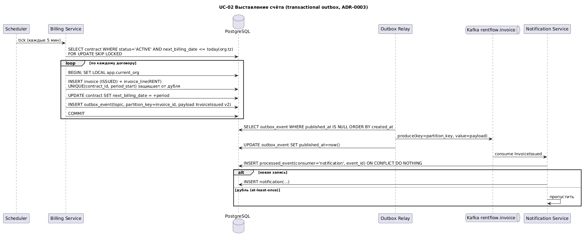
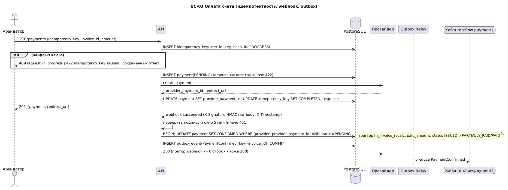
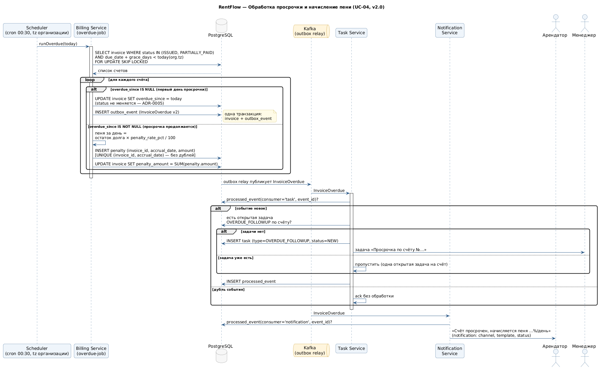

# 11. Sequence-диаграммы ключевых сценариев

Все диаграммы выполнены в PlantUML в едином стиле (`diagrams/_style.puml`). Исходники — в `diagrams/`, PNG-экспорты — в `img/`.

## 11.1. Автоматическое начисление платежа (UC-02)

**Предусловия:** договор в статусе ACTIVE, `next_billing_date` ≤ текущей даты. Ежедневно в 00:05 Billing Service выбирает такие договоры, формирует счёт в статусе ISSUED, сдвигает `next_billing_date` на следующий период и публикует событие `InvoiceIssued`. Повторный запуск за ту же дату идемпотентен: уникальность счёта обеспечивается ключом `(contract_id, period)`.

Исходник: `diagrams/seq_uc02_billing.puml`.

## 11.2. Оплата счёта через платёжный шлюз (UC-03)

**Предусловия:** арендатор аутентифицирован, счёт в статусе ISSUED или PARTIALLY_PAID (в т. ч. просроченный). Клиент вызывает `POST /invoices/{id}/payments` с заголовком `Idempotency-Key`; Payment Service создаёт платёж PENDING, получает `payment_url` от шлюза, затем обрабатывает webhook с HMAC-подписью, подтверждает платёж, переводит счёт в PAID / PARTIALLY_PAID и публикует `PaymentConfirmed`.

Исходник: `diagrams/seq_uc03_payment.puml`.

## 11.3. Обработка просрочки и начисление пени (UC-04)

**Предусловия:** счёт в статусе ISSUED или PARTIALLY_PAID, `due_date` < текущей даты. Ежедневный job (в часовом поясе организации) проставляет `overdue_since` (статус оплаты не меняется — ADR-0005), со следующего дня начисляет пеню в таблицу `penalty` (уникально по дате), пишет `InvoiceOverdue` в outbox по правилам договора, публикует `InvoiceOverdue`, Notification Service уведомляет арендатора, а менеджеру создаётся задача.

Исходник: `diagrams/seq_uc04_overdue.puml`.
